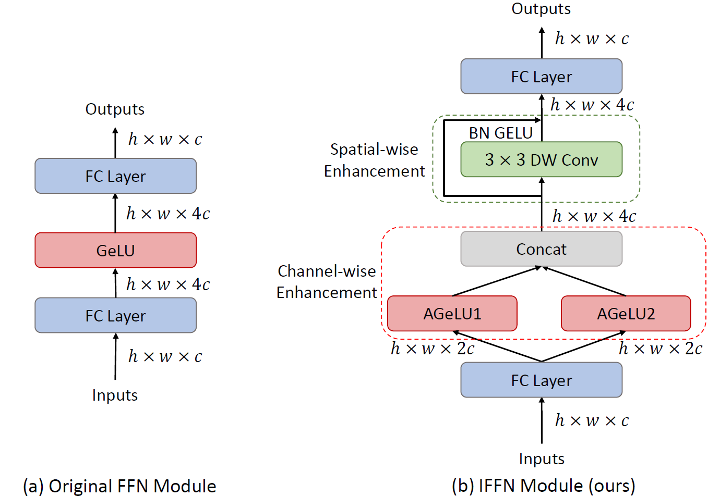

## Enhancing Vision Transformer: Amplifying Non-Linearity in Feedforward Network Module (ICML 2024)

**Yixing Xu, Chao Li, Dong Li, Xiao Sheng, Fan Jiang, Lu Tian, Ashish Sirasao, Emad Barsoum** | [Paper](https://openreview.net/pdf?id=NV0q2jdwo0)

Advanced Micro Devices, Inc.

</img>

---

## Dependancies

```bash
torch == 1.13.0
torchvision == 0.14.0
timm == 0.6.12
einops == 0.6.1
```

## Model performance

The image classification results of our models on ImageNet dataset are shown in the following table.

|Model|Parameters (M)|FLOPs(G)|Top-1 Accuracy (%)|
|-|-|-|-|
|DeiT-Ti|5.72|1.26|72.2|
|+IFFN (ours)|5.00|1.10|72.6|
|DeiT-S|22.05|4.60|79.9|
|+IFFN (ours)|18.84|3.93|80.0|
|DeiT-B|86.57|17.57|81.8|
|+IFFN (ours)|73.66|14.92|81.8|

## Model Evaluation

```bash
python main.py --model deit_base_patch16_224 --data-path /path/to/imagenet/ --resume /path/to/base_model/ --eval
```

## Model Training

DeiT-Ti+IFFN

```bash
python -m torch.distributed.launch --nproc_per_node=8 --use_env main.py --model deit_tiny_patch16_224 --batch-size 256 --epochs 300 --data-path /path/to/imagenet/ --output_dir ./output/iffn_ti/
```

DeiT-S+IFFN

```bash
python -m torch.distributed.launch --nproc_per_node=8 --use_env main.py --model deit_small_patch16_224 --batch-size 256 --epochs 300 --data-path /path/to/imagenet/ --output_dir ./output/iffn_s/```
```

DeiT-B+IFFN

```bash
python -m torch.distributed.launch --nproc_per_node=8 --use_env main.py --model deit_base_patch16_224 --batch-size 256 --epochs 300 --data-path /path/to/imagenet/ --output_dir ./output/iffn_b/```
```

## Citation

```
@inproceedings{xuenhancing,
  title={Enhancing Vision Transformer: Amplifying Non-Linearity in Feedforward Network Module},
  author={Xu, Yixing and Li, Chao and Li, Dong and Sheng, Xiao and Jiang, Fan and Tian, Lu and Sirasao, Ashish and Barsoum, Emad},
  booktitle={Forty-first International Conference on Machine Learning}
}
```
